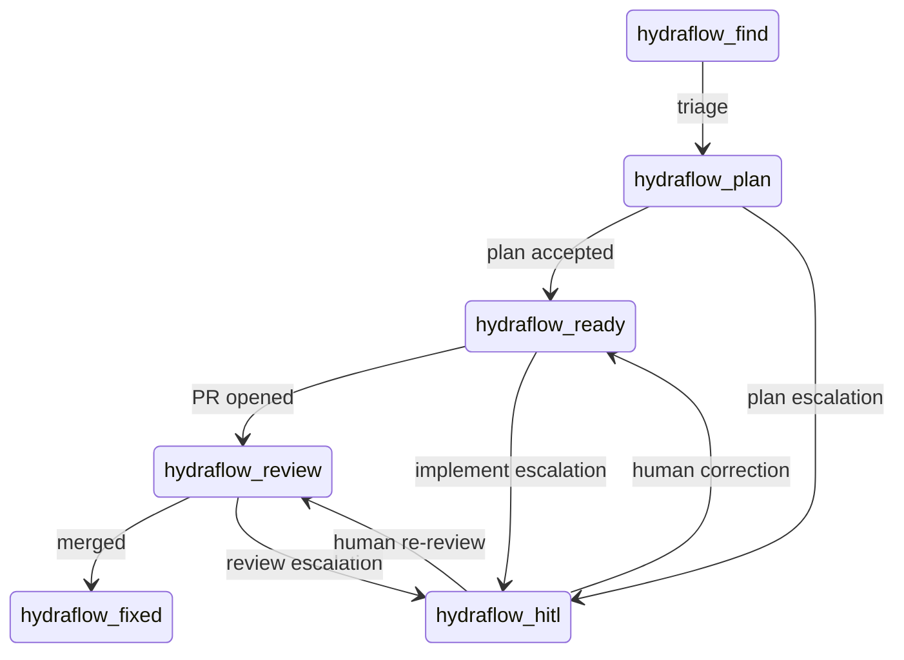

# ADR-0002: GitHub Labels as the Pipeline State Machine

**Status:** Accepted
**Date:** 2026-02-26
**Enforcement:** enforced
**Enforced by:** pytest:tests/test_state_machine.py
**Amended by:** ADR-0107 (Collapse Discover + Shape into Plan) — removes the
`hydraflow-discover` / `hydraflow-shape` labels from the state machine.

## Context

HydraFlow needs a way to track which stage each issue is currently in, and to
hand off issues between pipeline stages. Options considered:

1. A separate database or file tracking issue → stage mappings.
2. GitHub issue labels as the state signal.
3. A dedicated state file in the repo (`.hydraflow/state.json`).

The system must support:
- Multi-process / multi-machine operation (state must be shared).
- Human visibility into what the system is doing without custom tooling.
- Human override (move an issue backwards or skip a stage).
- Crash recovery (state survives process restarts).

## Decision

Use GitHub issue labels as the authoritative state machine. Each pipeline stage
maps to exactly one label:

```
hydraflow-find   → triageable
hydraflow-plan   → needs planning
hydraflow-ready  → ready for implementation
hydraflow-review → PR open, under review
hydraflow-hitl   → escalated for human intervention
hydraflow-fixed  → merged, done
```

Transitions are atomic via `swap_pipeline_labels()`: all other pipeline labels
are removed before the new one is added. This prevents the dual-label bug (where
a crash between remove and add leaves conflicting labels).

State is polled, not pushed: each loop queries GitHub for issues with its label.

### State transition diagram (machine-checked)

The legal pipeline-stage transitions are the *canonical edge set* of this state
machine. They are declared once, in code, as
`src/label_transitions.py:LABEL_TRANSITIONS` — the single source of truth the
runtime consults and the architecture extractor reads to render
`docs/arch/generated/labels.md`. The diagram below is the human-readable form of
that same edge set; `tests/architecture/test_label_state_matches_adr0002.py`
diffs the two on every PR and fails on any drift (issue #10621).



Orthogonal markers (`human-required`, `hydraflow-in-progress`) coexist with a
stage label rather than being one; they are not edges in this diagram (see the
build-claim marker section below).

### Build-claim marker: `ready → in-progress → review` (#10168)

The single-stage-label invariant covers *pipeline stages*. Alongside the stage
labels there are a small number of **orthogonal markers** that coexist with a
stage label without being one — `human-required` (blocked, ADR-0084) and, added
by #10168, `hydraflow-in-progress`.

`hydraflow-in-progress` is a **durable, cross-actor build claim**. The stage
machine holds an issue at `hydraflow-ready` for the *entire* build, only
flipping to `hydraflow-review` once a PR opens. During that window the sole
double-pick protection was `IssueStore._eagerly_transitioned` — in-memory, and
therefore single-process. Any *other* observer of GitHub labels (a second
factory instance, a parallel operator session, or an out-of-band Agent
dispatch) saw an unclaimed `hydraflow-ready` issue and could pick it too — the
cross-actor collision class first seen in #10141.

The marker closes that gap:

```
hydraflow-ready ──(build starts)──► hydraflow-ready + hydraflow-in-progress
                                          │
                        (PR opens: ready→review swap clears the marker)
                                          ▼
                                   hydraflow-review
```

- **Applied** when a build *starts* on a ready issue (`ImplementPhase._worker`
  → `PRPort.add_labels`). It is added, not swapped — the issue keeps
  `hydraflow-ready` so it is still visibly a ready-stage issue; the marker just
  says "already being built."
- **Cleared** when the PR opens: the `ready → review` `swap_pipeline_labels`
  removes it because `in_progress_label` is in `all_pipeline_labels` (exactly
  like `human-required`). It is also cleared on abandon/failure
  (`ImplementPhase._worker`'s `finally`) and by any escalation/route-back swap,
  so an issue can never get stuck claimed.
- **Honoured** by the work-picker: `IssueStore._is_eligible` treats any issue
  carrying `hydraflow-in-progress` as not-eligible-for-re-pick — the durable
  belt-and-suspenders to the in-process `_eagerly_transitioned` fast-path.

Because it is a marker and not a stage, it is absent from the stage-routing map
(`IssueStore._build_label_map`) and is excluded from the pipeline-stage pick in
`find_label_drift` (ADR-0088), so a `ready + in-progress` issue still reads as
`hydraflow-ready`.

## Consequences

**Positive:**
- Zero infrastructure: no database, no message broker, no external state store.
- Human-readable: anyone with GitHub access can see and modify pipeline state.
- Human override is trivial: drag a label to move an issue to any stage.
- Crash recovery is free: the orchestrator re-polls labels on startup and picks up
  where it left off.
- Works across machines and processes with no coordination protocol.

**Negative / Trade-offs:**
- GitHub API rate limits apply to all label reads/writes; high-volume repos may
  hit limits.
- Polling introduces latency proportional to the poll interval (default 30–60s).
  Label changes are not instant.
- No history: the label state machine has no built-in audit log of how an issue
  moved through stages (git history / transcript logs compensate for this).
- The dual-label invariant (exactly one pipeline *stage* label) must be maintained
  by all code paths; bypassing `swap_pipeline_labels` can break it. Orthogonal
  markers (`human-required`, `hydraflow-in-progress`) deliberately coexist with a
  stage label and are exempt from this invariant — they are cleared by every
  `swap_pipeline_labels` call because they are members of `all_pipeline_labels`.
- The build-claim marker is durable but best-effort: a GitHub hiccup while
  stamping or clearing it must never block a build (dark-factory contract), so
  the in-memory `IssueStore` guards remain the primary within-process defense and
  the label is the cross-actor backstop, not the sole mechanism.

## Related

- `src/pr_manager.py:PRManager.swap_pipeline_labels` — atomic swap implementation
- `src/config.py:HydraFlowConfig.all_pipeline_labels` — the full label set (stage labels +
  orthogonal markers `human-required`, `in_progress_label`)
- `src/config.py:HydraFlowConfig.in_progress_label` — the `hydraflow-in-progress` build-claim
  marker (#10168)
- `src/implement_phase.py:ImplementPhase._claim_issue` / `_release_claim` — stamp/clear the
  claim at build start / build exit (#10168)
- `src/issue_store.py:IssueStore._is_eligible` — skips issues carrying the claim marker (#10168)
- `tests/test_state_machine.py` — property-based invariant tests
- `tests/regressions/test_issue_10168_inprogress_claim_label.py` — build-claim
  marker regression (#10168)
- ADR-0001 (Five Concurrent Async Loops) for why polling loops were chosen over a push-based model
- ADR-0107 (Collapse Discover + Shape into Plan) — amends this state machine by
  removing the `hydraflow-discover` / `hydraflow-shape` labels
