# ADR-0094: HydraFlow Orchestration as a Control System

**Status:** Proposed
**Date:** 2026-06-30
**Enforced by:** `tests/test_seed_terms.py` (the seven `control_role` glossary terms load, resolve to `main` classes, and ship `accepted`), `(process)` (every orchestration component declares its control role)

## Context

HydraFlow's orchestration is already, structurally, a control system, but nowhere is it named as one, so its pieces are motivated one at a time and there is no shared vocabulary for reasoning about them. Sensors are rich but scattered (`MetricsSnapshot`, `sensor_enricher`, drift detectors, LLM judges, the Loop Fitness Scorecard); actuation is strong (runner dispatch → PR → label swap); internal corrective feedback is strong (reviewer verdict → re-injected prompt). The weak, unnamed link is the controller: issue selection is FIFO by label priority (`src/issue_store.py:_compute_stage_map`), and the rich sensor data is not fed into what-to-do-next decisions.

The v2 IssueDriver redesign makes this acute. Once one `IssueDriver` owns an issue find→merged, "which issue next, how many at once, is this one converged" become explicit control questions; v2's `SchedulingPolicy` is precisely a first-class controller and `PolicyScorecard` is precisely offline system identification. Naming the model now — before those phases land — means every phase is designed against one coherent decomposition, and ADR-0053's living glossary gains a vocabulary for the *roles* components play, not just the components themselves.

## Decision

Model HydraFlow's entire autonomous-loop layer as a **hierarchy of control loops**, and adopt a shared control-theory vocabulary of seven roles. Every current and future orchestration component declares which role(s) it plays.

### The seven roles

| Role | HydraFlow meaning |
|---|---|
| **Plant** | The process being driven — the repository + an issue's lifecycle; its durable state lives in the state store / `ConvergenceLedger`. |
| **Sensor** | Any component measuring current state (deterministic or LLM-based), producing a signal a controller reads. |
| **Set-point** | The desired state driven toward (issue MERGED + converged; drift = 0). Fixed for regulators, scaled for the blast-radius-scaled review bar. |
| **Error** | Set-point minus measured state — today mostly binary (findings present / `REQUEST_CHANGES`). |
| **Controller** | Converts error into a control action: what to do next, how hard. Supervisory (which issue) and inner (per-issue gate). |
| **Actuator** | Applies the action to the plant: dispatches a runner, opens a PR, swaps a label. |
| **Governor** | Saturation limits + safety interlocks bounding every actuator: concurrency caps, credit holds, kill switches. |

### Hierarchy of loops

- **Regulators — the caretaker fleet (ADR-0029).** Each caretaker loop is a single-input regulator holding one measured quantity at a fixed set-point and rejecting disturbances (`WikiRotDetectorLoop`/`AdrTouchpointAuditorLoop`: drift→0; `FlakeTrackerLoop`: flakes→0; `StaleIssueGcLoop`: stale issues→0).
- **Servo — the IssueDriver (v2).** Drives one issue from its current `driver_state` to the MERGED set-point along a trajectory. The `HybridGate` (ADR-0093) is its inner controller; the `ConvergenceLedger` is its error/state register.
- **Supervisory controller — the scheduler (v2 P2).** `DriverManager` + `SchedulingPolicy` allocate finite capacity across many servos: a pure control law (`select`) over a frozen sensor view (`SchedulingView`).
- **Governor (v2 P3).** The saturation limiter and emergency brake beneath the supervisory controller.
- **System identification (v2 P4).** `PolicyScorecard` + `ReplayDriverManager` score control laws offline; the autonomous auto-tuner is a deliberately-deferred adaptive loop.

### Component → role map

`code_anchor` is the single representative class each glossary term points at; "also realized by" is the many-to-one reality.

| Role | Representative anchor (main) | Also realized by |
|---|---|---|
| Plant | `src/models.py:StateData` (→ `IssueDriver` at P5) | repo, issues, `StateTracker`, `ConvergenceLedger` |
| Sensor | `src/models.py:MetricsSnapshot` (→ `SchedulingView` at P5) | `sensor_enricher`, `adr_drift`, `wiki_drift_detector`, `spec_judge`, `verification_judge`, `review_advisor`, Fitness Scorecard |
| Set-point | `src/issue_store.py:IssueStoreStage` (→ `ConvergenceLedger.converged` at P5) | blast-radius-scaled review bar, drift=0 targets |
| Error | `src/harness_insights.py:FailureRecord` | reviewer `REQUEST_CHANGES`, `spec_judge` Concerns, `route_backs`, laps |
| Controller (supervisory) | `src/issue_store.py:IssueStore` (→ `SchedulingPolicy` at P5) | queue priority tiers |
| Controller (inner) | `src/review_advisor.py:PostVerifyResult` (→ `HybridGate` at P5) | attempt caps, `adversarial_retry_loop` oscillation guard |
| Actuator | `src/base_runner.py:BaseRunner` | `pr_manager.py:PRManager` (create_pr, label swap), phase dispatch |
| Governor | `src/base_background_loop.py:LoopDeps` (→ P3 `Governor` at P5) | `max_workers`/`max_planners` semaphores, credit holds |

The glossary carries a single `Controller` term anchored to the supervisory `IssueStore`; the inner controller is documented here rather than as a second term. For LLM-judged signals the Sensor↔Error boundary blurs (a judge both measures and computes the deviation); the map assigns each component its dominant role.

### Loop-closure ledger

| Loop | Closure | Rationale |
|---|---|---|
| Caretaker regulators | Closed | Bounded blast radius; safe unattended (ADR-0029). |
| IssueDriver inner (gate/retry) | Closed | Oscillation guard + attempt cap + blast-radius-scaled budget bound it. |
| IssueDriver → HITL escalation | Open (by design) | High-uncertainty/high-blast cases route to a human; the reference input is human judgment. |
| Scheduler policy selection | Open (by design) | A human sets `scheduler.policy`; observe before automating. |
| Policy / fitness auto-tuning | Deferred-open | The measurable surface is built replay-ready; closing the adaptive loop waits until offline A/B justifies it. |

### Known-open control surfaces (named, not decided here)

1. **Error is binary, not continuous** — no per-issue error magnitude to act on proportionally.
2. **No integral / anti-starvation term** — scheduler open question on fairness.
3. **Disturbance rejection is reactive, not feedforward** — no generalized "snapshot baseline → block new → burn down" control component.
4. **Human-on-the-loop is discrete** — `pending_correction` + suspend/wake is single-shot, not a continuous reference channel.

Each is a candidate for its own future ADR/spec; this ADR names them, it does not decide them.

### Control-loop diagram

```mermaid
flowchart LR
    SP["Set-point<br/>(desired state)"] --> J(("&#8855;"))
    J -- "error" --> C["Controller"]
    C -- "control action" --> G{{"Governor<br/>(saturation / kill-switch)"}}
    G --> A["Actuator"]
    A -- "actuation" --> P["Plant<br/>(repo + issue lifecycle)"]
    P -- "measured state" --> S["Sensor"]
    S --> J
    H["Human<br/>(reference input)"] -.-> SP
```

## Consequences

- New loops and v2 phases are designed and reviewed against these roles; the loop-closure ledger makes each loop's closure level an explicit, recorded decision rather than an omission.
- The known-open control surfaces get their own ADRs/specs, with a shared vocabulary to describe them.
- ADR-0053's generated glossary (`docs/arch/generated/ubiquitous-language.md`) gains a `control_role` category, rendered on every PR.
- At the v2 P5 cutover, the representative anchors are re-pointed to the v2 symbols (Plant→`IssueDriver`, Sensor→`SchedulingView`, Controller→`SchedulingPolicy`/`HybridGate`, Governor→`Governor`); this is recorded as a P5 checklist item.
- This ADR does not change any runtime behavior; the only code touched is the `TermKind` enum.

## Alternatives considered

- **Scope to v2 IssueDriver only.** Rejected: the caretaker fleet are already control loops (regulators), so a v2-only framing would be less true and would miss the unifying hierarchy.
- **Seed role terms phase-by-phase as v2 symbols land.** Rejected: the full mental model is more useful now; anchoring to current `main` classes (re-anchored at P5) delivers the vocabulary immediately without tripping the anchor-drift gate.
- **Reuse existing `TermKind`s (`policy`/`service`).** Rejected: control roles are architectural roles, not DDD tactical patterns; mis-filing them would confuse the glossary. A dedicated `control_role` kind is honest.
- **A separate, non-ADR-0053 control glossary.** Rejected: duplicates the living-glossary machinery and loses the drift enforcement and generated rendering.
- **Supersede ADR-0001 now.** Rejected: the loop-architecture supersession belongs to the v2 P5 ADR set; ADR-0094 is the conceptual anchor that set will cite, and stays Proposed until then.

## Related

- ADR-0001 (five concurrent async loops — the layer this re-frames)
- ADR-0002 (labels as state machine — the set-point encoding)
- ADR-0029 (caretaker loop pattern — the regulators)
- ADR-0042 (two-tier branch/release promotion)
- ADR-0049 (kill-switch convention — the governor's interlock)
- ADR-0053 (ubiquitous language as a living artifact — the vocabulary discipline this extends)
- ADR-0093 (`ConvergenceLedger` + `HybridGate` — the servo's error register + inner controller)
- `src/ubiquitous_language.py:TermKind`, `src/issue_store.py:IssueStore`, `src/base_runner.py:BaseRunner`, `src/base_background_loop.py:LoopDeps`
