# Functional Area Map

<!-- generated by arch.generators.functional_areas; do not hand-edit -->

Top-level conceptual view of HydraFlow. Each cluster is a **functional area** — a coherent piece of what this machine does, curated in [`docs/arch/functional_areas.yml`](../functional_areas.yml). The loops/ports/modules inside each cluster are auto-joined from the live AST extractors. New loops or ports must be assigned to an area or `tests/architecture/test_functional_area_coverage.py` fails.

```mermaid
flowchart LR
    subgraph repo_health["Repo Health"]
        repo_health_AutoTightenLoop([AutoTightenLoop])
        repo_health_CIMonitorLoop([CIMonitorLoop])
        repo_health_DependabotMergeLoop([DependabotMergeLoop])
        repo_health_ErosionMetricsLoop([ErosionMetricsLoop])
        repo_health_EscapeLedgerLoop([EscapeLedgerLoop])
        repo_health_FailOpenMonitorLoop([FailOpenMonitorLoop])
        repo_health_FlakeTrackerLoop([FlakeTrackerLoop])
        repo_health_GateHealthLoop([GateHealthLoop])
        repo_health_InterventionTallyLoop([InterventionTallyLoop])
        repo_health_IssueRefinementLoop([IssueRefinementLoop])
        repo_health_LabelDriftWatcherLoop([LabelDriftWatcherLoop])
        repo_health_PrRedRepairLoop([PrRedRepairLoop])
        repo_health_RCBudgetLoop([RCBudgetLoop])
        repo_health_RunsGCLoop([RunsGCLoop])
        repo_health_SampledAuditLoop([SampledAuditLoop])
        repo_health_SecondOrderVitalsLoop([SecondOrderVitalsLoop])
        repo_health_SecurityPatchLoop([SecurityPatchLoop])
        repo_health_StaleIssueGCLoop([StaleIssueGCLoop])
        repo_health_StaleIssueLoop([StaleIssueLoop])
        repo_health_WorkspaceGCLoop([WorkspaceGCLoop])
    end
    subgraph learning["Learning & Insights"]
        learning_CorpusLearningLoop([CorpusLearningLoop])
        learning_EdgeProposerLoop([EdgeProposerLoop])
        learning_EntryEvidenceLoop([EntryEvidenceLoop])
        learning_FakeCoverageAuditorLoop([FakeCoverageAuditorLoop])
        learning_MemoryBacklogLoop([MemoryBacklogLoop])
        learning_PricingRefreshLoop([PricingRefreshLoop])
        learning_RepoWikiLoop([RepoWikiLoop])
        learning_RetrospectiveLoop([RetrospectiveLoop])
        learning_SkillPromptEvalLoop([SkillPromptEvalLoop])
        learning_TermProposerLoop([TermProposerLoop])
        learning_TermPrunerLoop([TermPrunerLoop])
    end
    subgraph governance["Governance & Audit"]
        governance_AdrConformanceLoop([AdrConformanceLoop])
        governance_AdrDriftResolverLoop([AdrDriftResolverLoop])
        governance_AdrTouchpointAuditorLoop([AdrTouchpointAuditorLoop])
        governance_BranchProtectionAuditorLoop([BranchProtectionAuditorLoop])
        governance_ContractRefreshLoop([ContractRefreshLoop])
        governance_DiagramLoop([DiagramLoop])
        governance_FitnessScorecardLoop([FitnessScorecardLoop])
        governance_GateActivatorLoop([GateActivatorLoop])
        governance_LiveCorpusReplayLoop([LiveCorpusReplayLoop])
        governance_PrinciplesAuditLoop([PrinciplesAuditLoop])
        governance_RailsDriftCaretakerLoop([RailsDriftCaretakerLoop])
        governance_WikiRotDetectorLoop([WikiRotDetectorLoop])
    end
    subgraph release["Release"]
        release_StagingBisectLoop([StagingBisectLoop])
        release_StagingPromotionLoop([StagingPromotionLoop])
    end
    subgraph meta_observability["Meta-Observability"]
        meta_observability_GoalSupervisorLoop([GoalSupervisorLoop])
        meta_observability_HealthMonitorLoop([HealthMonitorLoop])
        meta_observability_TrustFleetSanityLoop([TrustFleetSanityLoop])
    end
    subgraph operations["Operations"]
        operations_CostBudgetWatcherLoop([CostBudgetWatcherLoop])
        operations_DiagnosticLoop([DiagnosticLoop])
        operations_EpicMonitorLoop([EpicMonitorLoop])
        operations_EpicSweeperLoop([EpicSweeperLoop])
        operations_GitHubCacheLoop([GitHubCacheLoop])
        operations_MergeStateWatcherLoop([MergeStateWatcherLoop])
        operations_PRUnstickerLoop([PRUnstickerLoop])
    end
    subgraph intake["Intake"]
        intake_ADRReviewerLoop([ADRReviewerLoop])
        intake_LogIngestLoop([LogIngestLoop])
        intake_ReportIssueLoop([ReportIssueLoop])
    end
    subgraph autonomy["Autonomy"]
        autonomy_AutoAgentPreflightLoop([AutoAgentPreflightLoop])
        autonomy_ConvergenceOscillationLoop([ConvergenceOscillationLoop])
        autonomy_DetectorCalibrationLoop([DetectorCalibrationLoop])
        autonomy_DisturbanceDampenerLoop([DisturbanceDampenerLoop])
        autonomy_HumanSteeringLoop([HumanSteeringLoop])
        autonomy_SandboxFailureFixerLoop([SandboxFailureFixerLoop])
        autonomy_TriageRetryLoop([TriageRetryLoop])
    end
    subgraph hexagonal_boundaries["Hexagonal Boundaries"]
        hexagonal_boundaries_AgentPort[/AgentPort/]
        hexagonal_boundaries_BotPRPort[/BotPRPort/]
        hexagonal_boundaries_ConformanceRunnerPort[/ConformanceRunnerPort/]
        hexagonal_boundaries_IssueFetcherPort[/IssueFetcherPort/]
        hexagonal_boundaries_IssueStorePort[/IssueStorePort/]
        hexagonal_boundaries_ObservabilityPort[/ObservabilityPort/]
        hexagonal_boundaries_PRPort[/PRPort/]
        hexagonal_boundaries_ReviewInsightStorePort[/ReviewInsightStorePort/]
        hexagonal_boundaries_RouteBackCounterPort[/RouteBackCounterPort/]
        hexagonal_boundaries_WorkspacePort[/WorkspacePort/]
    end
    subgraph state_persistence["State & Persistence"]
    end
    subgraph test_harness["Test Harness (MockWorld)"]
    end
    subgraph arch_knowledge["Architecture Knowledge"]
    end
    subgraph dashboard["Dashboard"]
    end
    subgraph goal_driven_dev["Goal-Driven Development"]
    end
    subgraph orchestration["Orchestration"]
    end
    classDef unknown stroke:#c00,stroke-width:2px,stroke-dasharray:4 2;
```

## Repo Health

Security, quality, and hygiene workers that keep the repository healthy — dependency/security patching, CI-red repair, stale-issue and workspace GC, flake and erosion tracking, and the falsification instruments (escape ledger, intervention tally, sampled audit, second-order vitals) that guard against a green-while-dying pipeline.

**Loops**

- `AutoTightenLoop` — `src.auto_tighten_loop`
- `CIMonitorLoop` — `src.ci_monitor_loop`
- `DependabotMergeLoop` — `src.dependabot_merge_loop`
- `ErosionMetricsLoop` — `src.erosion_metrics_loop`
- `EscapeLedgerLoop` — `src.escape_ledger_loop`
- `FailOpenMonitorLoop` — `src.fail_open_monitor_loop`
- `FlakeTrackerLoop` — `src.flake_tracker_loop`
- `GateHealthLoop` — `src.gate_health_loop`
- `InterventionTallyLoop` — `src.intervention_tally_loop`
- `IssueRefinementLoop` — `src.issue_refinement_loop`
- `LabelDriftWatcherLoop` — `src.label_drift_watcher_loop`
- `PrRedRepairLoop` — `src.pr_red_repair_loop`
- `RCBudgetLoop` — `src.rc_budget_loop`
- `RunsGCLoop` — `src.runs_gc_loop`
- `SampledAuditLoop` — `src.sampled_audit_loop`
- `SecondOrderVitalsLoop` — `src.second_order_vitals_loop`
- `SecurityPatchLoop` — `src.security_patch_loop`
- `StaleIssueGCLoop` — `src.stale_issue_gc_loop`
- `StaleIssueLoop` — `src.stale_issue_loop`
- `WorkspaceGCLoop` — `src.workspace_gc_loop`

**Related ADRs:** `ADR-0029`, `ADR-0045`, `ADR-0049`, `ADR-0082`

## Learning & Insights

Knowledge and insight workers that digest what the factory produces — retrospective analysis, repo-wiki freshness, term proposal/pruning, memory backlog, corpus learning, edge/skill proposals, pricing refresh, and fake-coverage auditing.

**Loops**

- `CorpusLearningLoop` — `src.corpus_learning_loop`
- `EdgeProposerLoop` — `src.edge_proposer_loop`
- `EntryEvidenceLoop` — `src.entry_evidence_loop`
- `FakeCoverageAuditorLoop` — `src.fake_coverage_auditor_loop`
- `MemoryBacklogLoop` — `src.memory_backlog_loop`
- `PricingRefreshLoop` — `src.pricing_refresh_loop`
- `RepoWikiLoop` — `src.repo_wiki_loop`
- `RetrospectiveLoop` — `src.retrospective_loop`
- `SkillPromptEvalLoop` — `src.skill_prompt_eval_loop`
- `TermProposerLoop` — `src.term_proposer_loop`
- `TermPrunerLoop` — `src.term_pruner_loop`

**Related ADRs:** `ADR-0029`, `ADR-0032`, `ADR-0053`

## Governance & Audit

Audit, compliance, and drift workers that hold the factory to its own declared rules — ADR conformance/drift/touchpoint auditing, branch- protection and gate-activation audits, contract refresh, principles audit, live-corpus replay, fitness scorecards, wiki-rot detection, and the self-documenting architecture DiagramLoop.

**Loops**

- `AdrConformanceLoop` — `src.adr_conformance_loop`
- `AdrDriftResolverLoop` — `src.adr_drift_resolver_loop`
- `AdrTouchpointAuditorLoop` — `src.adr_touchpoint_auditor_loop`
- `BranchProtectionAuditorLoop` — `src.branch_protection_auditor_loop`
- `ContractRefreshLoop` — `src.contract_refresh_loop`
- `DiagramLoop` — `src.diagram_loop`
- `FitnessScorecardLoop` — `src.fitness_scorecard_loop`
- `GateActivatorLoop` — `src.gate_activator_loop`
- `LiveCorpusReplayLoop` — `src.live_corpus_replay_loop`
- `PrinciplesAuditLoop` — `src.principles_audit_loop`
- `RailsDriftCaretakerLoop` — `src.rails_drift_caretaker_loop`
- `WikiRotDetectorLoop` — `src.wiki_rot_detector_loop`

**Related ADRs:** `ADR-0045`, `ADR-0082`, `ADR-0100`, `ADR-0101`, `ADR-0121`

## Release

Release-candidate promotion and recovery per the two-tier branch model (ADR-0042) — cutting RC snapshots from staging and auto-promoting on green CI, and bisecting the culprit PR on RC-red with an auto-revert.

**Loops**

- `StagingBisectLoop` — `src.staging_bisect_loop`
- `StagingPromotionLoop` — `src.staging_promotion_loop`

**Related ADRs:** `ADR-0042`

## Meta-Observability

Monitoring and observability workers that watch the factory watching itself — pipeline-trend health monitoring / auto-tuning and the trust-fleet sanity check that keeps the meta-observability layer honest.

**Loops**

- `GoalSupervisorLoop` — `src.goal_supervisor_loop`
- `HealthMonitorLoop` — `src.health_monitor_loop`
- `TrustFleetSanityLoop` — `src.trust_fleet_sanity_loop`

**Related ADRs:** `ADR-0045`, `ADR-0056`, `ADR-0124`

## Operations

Infrastructure, recovery, and lifecycle workers that keep the pipeline moving — cost-budget watching, diagnostics, epic monitoring/sweeping, GitHub cache, merge-state watching, and PR unsticking.

**Loops**

- `CostBudgetWatcherLoop` — `src.cost_budget_watcher_loop`
- `DiagnosticLoop` — `src.diagnostic_loop`
- `EpicMonitorLoop` — `src.epic_monitor_loop`
- `EpicSweeperLoop` — `src.epic_sweeper_loop`
- `GitHubCacheLoop` — `src.github_cache_loop`
- `MergeStateWatcherLoop` — `src.merge_state_watcher_loop`
- `PRUnstickerLoop` — `src.pr_unsticker_loop`

**Related ADRs:** `ADR-0029`

## Intake

Intake workers that turn external signals into pipeline work — ADR review routing, Sentry error ingest, server-log error ingest, and queued bug-report processing.

**Loops**

- `ADRReviewerLoop` — `src.adr_reviewer_loop`
- `LogIngestLoop` — `src.log_ingest_loop`
- `ReportIssueLoop` — `src.report_issue_loop`

**Related ADRs:** `ADR-0029`, `ADR-0050`

## Autonomy

The HITL-autonomy fleet that closes the loop without a human — the Auto-Agent pre-flight interceptor, triage-retry re-entry, human-steering ingest, detector calibration, disturbance dampening, convergence- oscillation damping, and sandbox-failure fixing. Per ADR-0050/0063.

**Loops**

- `AutoAgentPreflightLoop` — `src.auto_agent_preflight_loop`
- `ConvergenceOscillationLoop` — `src.convergence_oscillation_loop`
- `DetectorCalibrationLoop` — `src.detector_calibration_loop`
- `DisturbanceDampenerLoop` — `src.disturbance_dampener_loop`
- `HumanSteeringLoop` — `src.human_steering_loop`
- `SandboxFailureFixerLoop` — `src.sandbox_failure_fixer_loop`
- `TriageRetryLoop` — `src.triage_retry_loop`

**Module globs**

- `src/auto_agent_preflight_loop.py`
- `src/preflight/**`
- `src/triage_retry_loop.py`
- `src/convergence_oscillation_loop.py`
- `src/human_steering_loop.py`
- `src/human_steering.py`

**Related ADRs:** `ADR-0050`, `ADR-0063`, `ADR-0098`, `ADR-0099`

## Hexagonal Boundaries

The Port/Adapter seam between domain runtime and the outside world (GitHub, git, the LLM, the filesystem, observability, conformance running). Each Port has at least one concrete adapter and (per ADR-0047) a fake under src/mockworld/fakes/.

**Ports**

- `AgentPort` — `src.ports`
- `BotPRPort` — `src.term_proposer_loop`
- `ConformanceRunnerPort` — `src.ports`
- `IssueFetcherPort` — `src.ports`
- `IssueStorePort` — `src.ports`
- `ObservabilityPort` — `src.ports`
- `PRPort` — `src.ports`
- `ReviewInsightStorePort` — `src.ports`
- `RouteBackCounterPort` — `src.route_back`
- `WorkspacePort` — `src.ports`

**Related ADRs:** `ADR-0006`, `ADR-0010`, `ADR-0047`

## State & Persistence

Crash-recovery state (StateTracker), event bus, session logs, and the on-disk layout that keeps the pipeline resumable across crashes and restarts.

**Module globs**

- `src/state/**`
- `src/events.py`
- `src/state/_session.py`

**Related ADRs:** `ADR-0021`, `ADR-0028`

## Test Harness (MockWorld)

The scenario-ring test harness — `MockWorld` aggregates the fakes that emulate every external dependency and integration target. Per ADR-0022 (MockWorld) and ADR-0047 (fake-adapter contract testing).

**Module globs**

- `tests/scenarios/fakes/**`
- `tests/scenarios/builders/**`

**Related ADRs:** `ADR-0022`, `ADR-0047`

## Architecture Knowledge

The self-documenting layer — AST extractors, generators, CI guard, and Pages site that publish live architectural truth alongside ADRs and the wiki. The DiagramLoop that refreshes it lives under Governance & Audit.

**Module globs**

- `src/arch/**`

**Related ADRs:** `ADR-0029`, `ADR-0032`

## Dashboard

The operator-facing FastAPI + React dashboard for observing the fleet and overriding routing decisions.

**Module globs**

- `src/ui/**`
- `src/dashboard*.py`
- `src/dashboard_routes/**`
- `src/routes/**`

**Related ADRs:** `ADR-0007`, `ADR-0008`, `ADR-0009`, `ADR-0030`

## Goal-Driven Development

Discovery research and direction shaping for vague or broad work. ADR-0107 retired the standalone Discover/Shape pipeline phases: these engines (DiscoverRunner / ShapeRunner and their expander / completeness / coherence helpers) are now invoked on demand by the planner behind its decision gate rather than as dedicated loops or labels.

**Module globs**

- `src/discover_runner.py`
- `src/discover_expander.py`
- `src/discover_completeness.py`
- `src/shape_runner.py`
- `src/shape_coherence.py`

**Related ADRs:** `ADR-0031`, `ADR-0107`

## Orchestration

The plan->implement->review pipeline driving each issue from hydraflow-ready through merge. The original five-loop system per ADR-0001 (now amended); RunLoop and friends live as call-sites within orchestrator.py rather than as separate BaseBackgroundLoop subclasses.

**Module globs**

- `src/orchestrator.py`
- `src/agent.py`
- `src/planner.py`
- `src/reviewer.py`
- `src/triage_phase.py`
- `src/plan_phase.py`
- `src/implement_phase.py`
- `src/review_phase/`
- `src/hitl_phase.py`

**Related ADRs:** `ADR-0001`, `ADR-0004`, `ADR-0011`, `ADR-0012`, `ADR-0029`

<!-- arch:generated -->
