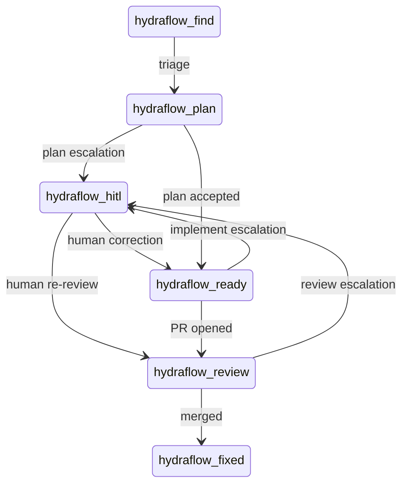

# Label State Machine

<!-- generated by arch.generators.label_state; do not hand-edit -->

Live transitions extracted from source. Compared against the Mermaid block in ADR-0002 by `tests/architecture/test_label_state_matches_adr0002.py`.

<!-- arch:generated -->
