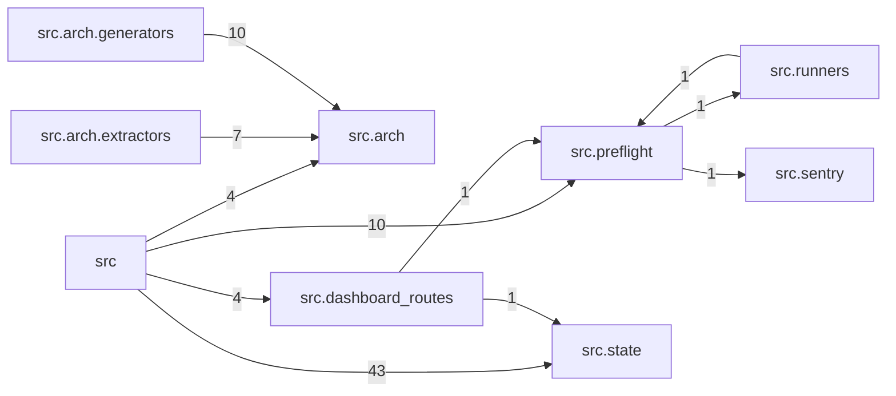

# Module Graph

<!-- generated by arch.generators.module_graph; do not hand-edit -->

Package-level import graph for `src/`. Edge weight = number of import statements aggregated across files.

_Regenerated from commit `c3f3b17` on 2026-04-27 03:03 UTC. Source last changed at `c3f3b17`. Status: 🟢 fresh._
