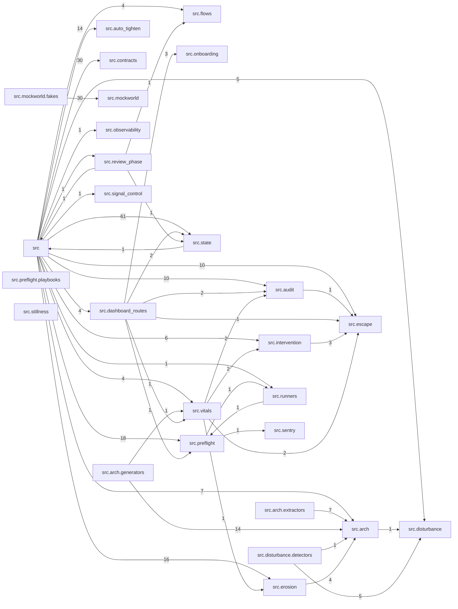

# Module Graph

<!-- generated by arch.generators.module_graph; do not hand-edit -->

Package-level import graph for `src/`. Edge weight = number of import statements aggregated across files.

```mermaid
graph LR
    src["src"]
    src_arch["src.arch"]
    src_arch_extractors["src.arch.extractors"]
    src_arch_generators["src.arch.generators"]
    src_audit["src.audit"]
    src_auto_tighten["src.auto_tighten"]
    src_contracts["src.contracts"]
    src_dashboard_routes["src.dashboard_routes"]
    src_disturbance["src.disturbance"]
    src_disturbance_detectors["src.disturbance.detectors"]
    src_erosion["src.erosion"]
    src_escape["src.escape"]
    src_flows["src.flows"]
    src_intervention["src.intervention"]
    src_mockworld["src.mockworld"]
    src_mockworld_fakes["src.mockworld.fakes"]
    src_observability["src.observability"]
    src_onboarding["src.onboarding"]
    src_preflight["src.preflight"]
    src_preflight_playbooks["src.preflight.playbooks"]
    src_review_phase["src.review_phase"]
    src_runners["src.runners"]
    src_sentry["src.sentry"]
    src_signal_control["src.signal_control"]
    src_state["src.state"]
    src_stillness["src.stillness"]
    src_vitals["src.vitals"]
    src -- "7" --> src_arch
    src -- "10" --> src_audit
    src -- "14" --> src_auto_tighten
    src -- "30" --> src_contracts
    src -- "4" --> src_dashboard_routes
    src -- "5" --> src_disturbance
    src -- "16" --> src_erosion
    src -- "10" --> src_escape
    src -- "4" --> src_flows
    src -- "6" --> src_intervention
    src -- "1" --> src_observability
    src -- "18" --> src_preflight
    src -- "1" --> src_review_phase
    src -- "1" --> src_runners
    src -- "1" --> src_signal_control
    src -- "61" --> src_state
    src -- "4" --> src_vitals
    src_arch -- "1" --> src_disturbance
    src_arch_extractors -- "7" --> src_arch
    src_arch_generators -- "14" --> src_arch
    src_arch_generators -- "1" --> src_vitals
    src_audit -- "1" --> src_escape
    src_dashboard_routes -- "2" --> src_audit
    src_dashboard_routes -- "1" --> src_escape
    src_dashboard_routes -- "3" --> src_onboarding
    src_dashboard_routes -- "1" --> src_preflight
    src_dashboard_routes -- "2" --> src_state
    src_dashboard_routes -- "1" --> src_vitals
    src_disturbance_detectors -- "1" --> src_arch
    src_disturbance_detectors -- "5" --> src_disturbance
    src_erosion -- "4" --> src_arch
    src_intervention -- "3" --> src_escape
    src_mockworld_fakes -- "30" --> src_mockworld
    src_preflight -- "1" --> src_runners
    src_preflight -- "1" --> src_sentry
    src_review_phase -- "1" --> src
    src_review_phase -- "1" --> src_flows
    src_review_phase -- "1" --> src_state
    src_runners -- "1" --> src_preflight
    src_state -- "1" --> src
    src_vitals -- "2" --> src_audit
    src_vitals -- "1" --> src_erosion
    src_vitals -- "2" --> src_escape
    src_vitals -- "2" --> src_intervention
```

<!-- arch:generated -->
