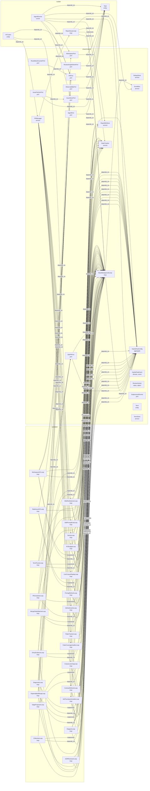

<!-- DO NOT EDIT — generated by src/ubiquitous_language.py:render_context_map -->

# Ubiquitous Language — Context Map

```mermaid
graph LR
  subgraph builder
    AgentRunner["AgentRunner<br/><i>runner</i>"]
    HITLItem["HITLItem<br/><i>entity</i>"]
    ReportIssueLoop["ReportIssueLoop<br/><i>loop</i>"]
    Task["Task<br/><i>entity</i>"]
  end
  subgraph caretaker
    ADRReviewerLoop["ADRReviewerLoop<br/><i>loop</i>"]
    AdrTouchpointAuditorLoop["AdrTouchpointAuditorLoop<br/><i>loop</i>"]
    CIMonitorLoop["CIMonitorLoop<br/><i>loop</i>"]
    ContractRefreshLoop["ContractRefreshLoop<br/><i>loop</i>"]
    CorpusLearningLoop["CorpusLearningLoop<br/><i>loop</i>"]
    DependabotMergeLoop["DependabotMergeLoop<br/><i>loop</i>"]
    DiagnosticLoop["DiagnosticLoop<br/><i>loop</i>"]
    DiagramLoop["DiagramLoop<br/><i>loop</i>"]
    EdgeProposerLoop["EdgeProposerLoop<br/><i>loop</i>"]
    EntryEvidenceLoop["EntryEvidenceLoop<br/><i>loop</i>"]
    FakeCoverageAuditorLoop["FakeCoverageAuditorLoop<br/><i>loop</i>"]
    FlakeTrackerLoop["FlakeTrackerLoop<br/><i>loop</i>"]
    GitHubCacheLoop["GitHubCacheLoop<br/><i>loop</i>"]
    GitHubCacheLoop["GitHubCacheLoop<br/><i>loop</i>"]
    LiveCorpusReplayLoop["LiveCorpusReplayLoop<br/><i>loop</i>"]
    MergeStateWatcherLoop["MergeStateWatcherLoop<br/><i>loop</i>"]
    PricingRefreshLoop["PricingRefreshLoop<br/><i>loop</i>"]
    PRUnstickerLoop["PRUnstickerLoop<br/><i>loop</i>"]
    RCBudgetLoop["RCBudgetLoop<br/><i>loop</i>"]
    SentryLoop["SentryLoop<br/><i>loop</i>"]
    SkillPromptEvalLoop["SkillPromptEvalLoop<br/><i>loop</i>"]
    StaleIssueGCLoop["StaleIssueGCLoop<br/><i>loop</i>"]
    TermPrunerLoop["TermPrunerLoop<br/><i>loop</i>"]
    WikiRotDetectorLoop["WikiRotDetectorLoop<br/><i>loop</i>"]
    WorkspaceGCLoop["WorkspaceGCLoop<br/><i>loop</i>"]
  end
  subgraph shared-kernel
    AgentPort["AgentPort<br/><i>port</i>"]
    BaseBackgroundLoop["BaseBackgroundLoop<br/><i>loop</i>"]
    BotPRPort["BotPRPort<br/><i>port</i>"]
    DedupStore["DedupStore<br/><i>service</i>"]
    EventBus["EventBus<br/><i>service</i>"]
    HydraFlowConfig["HydraFlowConfig<br/><i>aggregate</i>"]
    HydraFlowEvent["HydraFlowEvent<br/><i>domain_event</i>"]
    IssueFetcherPort["IssueFetcherPort<br/><i>port</i>"]
    IssueStorePort["IssueStorePort<br/><i>port</i>"]
    ObservabilityPort["ObservabilityPort<br/><i>port</i>"]
    PRManager["PRManager<br/><i>service</i>"]
    PRPort["PRPort<br/><i>port</i>"]
    RepoWikiStore["RepoWikiStore<br/><i>service</i>"]
    ReviewInsightStorePort["ReviewInsightStorePort<br/><i>port</i>"]
    ReviewVerdict["ReviewVerdict<br/><i>value_object</i>"]
    RouteBackCounterPort["RouteBackCounterPort<br/><i>port</i>"]
    StateTracker["StateTracker<br/><i>service</i>"]
    SubprocessRunner["SubprocessRunner<br/><i>port</i>"]
    Term["Term<br/><i>entity</i>"]
    TermStore["TermStore<br/><i>service</i>"]
    WorkspacePort["WorkspacePort<br/><i>port</i>"]
  end
  ADRReviewerLoop -->|depends_on| HydraFlowConfig
  ADRReviewerLoop -->|depends_on| BaseBackgroundLoop
  ADRReviewerLoop -->|implements| BaseBackgroundLoop
  AdrTouchpointAuditorLoop -->|depends_on| BaseBackgroundLoop
  AdrTouchpointAuditorLoop -->|depends_on| StateTracker
  AdrTouchpointAuditorLoop -->|depends_on| HydraFlowConfig
  AdrTouchpointAuditorLoop -->|implements| BaseBackgroundLoop
  AgentPort -->|depends_on| Task
  AgentRunner -->|depends_on| PRPort
  AgentRunner -->|depends_on| WorkspacePort
  AgentRunner -->|depends_on| IssueStorePort
  AgentRunner -->|depends_on| HydraFlowConfig
  AgentRunner -->|depends_on| RepoWikiStore
  AgentRunner -->|depends_on| Task
  AgentRunner -->|depends_on| EventBus
  BaseBackgroundLoop -->|depends_on| EventBus
  BaseBackgroundLoop -->|depends_on| HydraFlowConfig
  BotPRPort -->|depends_on| HydraFlowConfig
  BotPRPort -->|depends_on| BaseBackgroundLoop
  CIMonitorLoop -->|depends_on| PRPort
  CIMonitorLoop -->|depends_on| HydraFlowConfig
  CIMonitorLoop -->|depends_on| BaseBackgroundLoop
  CIMonitorLoop -->|implements| BaseBackgroundLoop
  ContractRefreshLoop -->|depends_on| BaseBackgroundLoop
  ContractRefreshLoop -->|depends_on| StateTracker
  ContractRefreshLoop -->|depends_on| HydraFlowConfig
  ContractRefreshLoop -->|implements| BaseBackgroundLoop
  CorpusLearningLoop -->|depends_on| BaseBackgroundLoop
  CorpusLearningLoop -->|depends_on| StateTracker
  CorpusLearningLoop -->|depends_on| HydraFlowConfig
  CorpusLearningLoop -->|implements| BaseBackgroundLoop
  DependabotMergeLoop -->|depends_on| PRPort
  DependabotMergeLoop -->|depends_on| HydraFlowConfig
  DependabotMergeLoop -->|depends_on| BaseBackgroundLoop
  DependabotMergeLoop -->|depends_on| StateTracker
  DependabotMergeLoop -->|implements| BaseBackgroundLoop
  DiagnosticLoop -->|depends_on| BaseBackgroundLoop
  DiagnosticLoop -->|depends_on| StateTracker
  DiagnosticLoop -->|depends_on| PRPort
  DiagnosticLoop -->|depends_on| HydraFlowConfig
  DiagnosticLoop -->|implements| BaseBackgroundLoop
  DiagramLoop -->|depends_on| HydraFlowConfig
  DiagramLoop -->|depends_on| BaseBackgroundLoop
  DiagramLoop -->|implements| BaseBackgroundLoop
  EdgeProposerLoop -->|depends_on| BaseBackgroundLoop
  EdgeProposerLoop -->|depends_on| HydraFlowConfig
  EdgeProposerLoop -->|depends_on| BotPRPort
  EdgeProposerLoop -->|implements| BaseBackgroundLoop
  EntryEvidenceLoop -->|depends_on| BaseBackgroundLoop
  EntryEvidenceLoop -->|depends_on| RepoWikiStore
  EntryEvidenceLoop -->|depends_on| HydraFlowConfig
  EntryEvidenceLoop -->|depends_on| BotPRPort
  EntryEvidenceLoop -->|implements| BaseBackgroundLoop
  FakeCoverageAuditorLoop -->|depends_on| BaseBackgroundLoop
  FakeCoverageAuditorLoop -->|depends_on| StateTracker
  FakeCoverageAuditorLoop -->|depends_on| HydraFlowConfig
  FakeCoverageAuditorLoop -->|implements| BaseBackgroundLoop
  FlakeTrackerLoop -->|depends_on| BaseBackgroundLoop
  FlakeTrackerLoop -->|depends_on| HydraFlowConfig
  FlakeTrackerLoop -->|depends_on| StateTracker
  FlakeTrackerLoop -->|implements| BaseBackgroundLoop
  GitHubCacheLoop -->|depends_on| BaseBackgroundLoop
  GitHubCacheLoop -->|depends_on| HydraFlowConfig
  GitHubCacheLoop -->|implements| BaseBackgroundLoop
  HITLItem -->|depends_on| GitHubCacheLoop
  HITLItem -->|depends_on| PRPort
  HITLItem -->|depends_on| PRManager
  IssueFetcherPort -->|depends_on| IssueStorePort
  IssueFetcherPort -->|depends_on| Task
  IssueStorePort -->|depends_on| Task
  LiveCorpusReplayLoop -->|depends_on| HydraFlowConfig
  LiveCorpusReplayLoop -->|depends_on| BaseBackgroundLoop
  LiveCorpusReplayLoop -->|depends_on| StateTracker
  LiveCorpusReplayLoop -->|implements| BaseBackgroundLoop
  MergeStateWatcherLoop -->|depends_on| PRPort
  MergeStateWatcherLoop -->|depends_on| HydraFlowConfig
  MergeStateWatcherLoop -->|depends_on| BaseBackgroundLoop
  MergeStateWatcherLoop -->|implements| BaseBackgroundLoop
  ObservabilityPort -->|depends_on| Task
  PricingRefreshLoop -->|depends_on| BaseBackgroundLoop
  PricingRefreshLoop -->|depends_on| HydraFlowConfig
  PricingRefreshLoop -->|implements| BaseBackgroundLoop
  PRManager -->|depends_on| AdrTouchpointAuditorLoop
  PRManager -->|depends_on| ContractRefreshLoop
  PRManager -->|depends_on| CorpusLearningLoop
  PRManager -->|depends_on| FakeCoverageAuditorLoop
  PRManager -->|depends_on| FlakeTrackerLoop
  PRManager -->|depends_on| GitHubCacheLoop
  PRManager -->|depends_on| LiveCorpusReplayLoop
  PRManager -->|depends_on| RCBudgetLoop
  PRManager -->|depends_on| ReportIssueLoop
  PRManager -->|depends_on| SentryLoop
  PRManager -->|depends_on| SkillPromptEvalLoop
  PRManager -->|depends_on| WikiRotDetectorLoop
  PRPort -->|depends_on| Task
  PRUnstickerLoop -->|depends_on| PRPort
  PRUnstickerLoop -->|depends_on| HydraFlowConfig
  PRUnstickerLoop -->|depends_on| BaseBackgroundLoop
  PRUnstickerLoop -->|implements| BaseBackgroundLoop
  RCBudgetLoop -->|depends_on| BaseBackgroundLoop
  RCBudgetLoop -->|depends_on| StateTracker
  RCBudgetLoop -->|depends_on| HydraFlowConfig
  RCBudgetLoop -->|implements| BaseBackgroundLoop
  ReportIssueLoop -->|depends_on| BaseBackgroundLoop
  ReportIssueLoop -->|depends_on| StateTracker
  ReportIssueLoop -->|depends_on| HydraFlowConfig
  ReportIssueLoop -->|implements| BaseBackgroundLoop
  ReviewInsightStorePort -->|depends_on| Task
  RouteBackCounterPort -->|depends_on| PRPort
  SentryLoop -->|depends_on| BaseBackgroundLoop
  SentryLoop -->|depends_on| StateTracker
  SentryLoop -->|depends_on| HydraFlowConfig
  SentryLoop -->|implements| BaseBackgroundLoop
  SkillPromptEvalLoop -->|depends_on| BaseBackgroundLoop
  SkillPromptEvalLoop -->|depends_on| StateTracker
  SkillPromptEvalLoop -->|depends_on| HydraFlowConfig
  SkillPromptEvalLoop -->|implements| BaseBackgroundLoop
  StaleIssueGCLoop -->|depends_on| PRPort
  StaleIssueGCLoop -->|depends_on| HydraFlowConfig
  StaleIssueGCLoop -->|depends_on| BaseBackgroundLoop
  StaleIssueGCLoop -->|implements| BaseBackgroundLoop
  TermPrunerLoop -->|depends_on| BotPRPort
  TermPrunerLoop -->|depends_on| HydraFlowConfig
  TermPrunerLoop -->|depends_on| BaseBackgroundLoop
  TermPrunerLoop -->|implements| BaseBackgroundLoop
  WikiRotDetectorLoop -->|depends_on| BaseBackgroundLoop
  WikiRotDetectorLoop -->|depends_on| StateTracker
  WikiRotDetectorLoop -->|depends_on| RepoWikiStore
  WikiRotDetectorLoop -->|depends_on| HydraFlowConfig
  WikiRotDetectorLoop -->|implements| BaseBackgroundLoop
  WorkspaceGCLoop -->|depends_on| PRPort
  WorkspaceGCLoop -->|depends_on| WorkspacePort
  WorkspaceGCLoop -->|depends_on| HydraFlowConfig
  WorkspaceGCLoop -->|depends_on| BaseBackgroundLoop
  WorkspaceGCLoop -->|depends_on| StateTracker
  WorkspaceGCLoop -->|implements| BaseBackgroundLoop
  WorkspacePort -->|depends_on| Task
```
