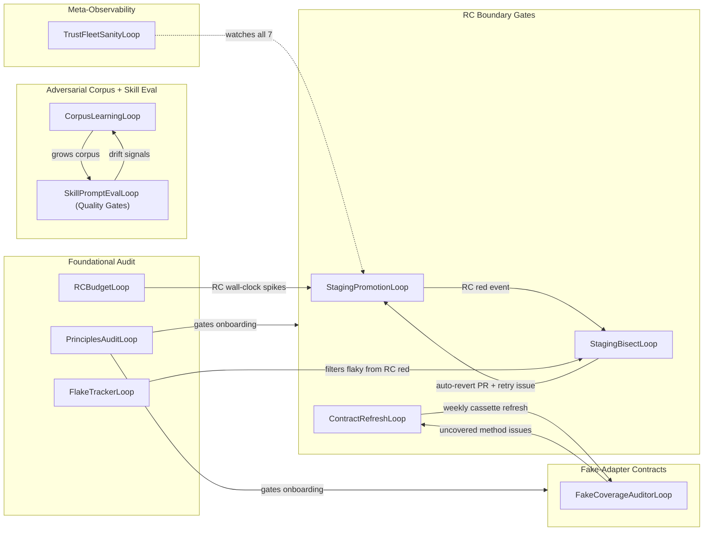

# Trust Fleet Topology

The **Trust Fleet** is the layer of caretaker loops that hardens HydraFlow's
delivery pipeline against silent regression. Per
[ADR-0045](../adr/0045-trust-architecture-hardening.md), it consists of
**8 autonomous loops** plus 2 non-loop subsystems, all running concurrently
and feeding each other through events, issue labels, and shared state.

This page is hand-curated — it captures the **intent** of the trust fleet's
internal relationships. The corresponding loop list is auto-generated from
source at [Loop Registry](generated/loops.md); per-area assignments live in
[`functional_areas.yml`](functional_areas.yml).

## Internal data flow

## Loops in detail

| Loop | Role | Triggers / Reads | Emits / Writes |
|---|---|---|---|
| **StagingPromotionLoop** | Cuts RC snapshots from staging; auto-promotes on green CI. | merges to `staging` branch | `RC_RED` event on failure; promotion PR on success |
| **StagingBisectLoop** | Bisects culprit PR on RC red; auto-revert + retry issue. | `RC_RED` event | revert PR; `staging-bisect-stuck` escalation |
| **ContractRefreshLoop** | Weekly refresh of fake-adapter cassettes against live `gh`/`git`/`docker`/`claude`. | weekly tick | refresh PR; `fake-drift` issues |
| **CorpusLearningLoop** | Grows the adversarial skill corpus from production escapes. | escape signals from skill chain | new test cases in `tests/trust/adversarial/cases/` |
| **FakeCoverageAuditorLoop** | Flags un-cassetted fake methods, un-exercised helpers. | scan tick | `fake-coverage-gap` issues |
| **PrinciplesAuditLoop** | ADR-0044 principle conformance audit. | weekly | drift PRs / issues; gates other trust loops on green audit |
| **FlakeTrackerLoop** | Detects persistently flaky tests across last N RC runs. | RC results | `flake-tracker` issues |
| **RCBudgetLoop** | Detects RC wall-clock bloat (rolling-median + spike-vs-max signals). | RC timing | `rc-budget` `hydraflow-find` issues |
| **TrustFleetSanityLoop** | Meta-observability — watches the other 8. | other loops' status events | one-attempt escalations on issue-storm / repair-failure / staleness / cost spikes |

## Non-loop subsystems

- **Adversarial skill corpus** at `tests/trust/adversarial/` — read by both `CorpusLearningLoop` (writer) and the post-implementation skill chain (reader).
- **VCR-style contract cassettes** at `tests/trust/contracts/cassettes/` — committed YAML; refreshed by `ContractRefreshLoop`.

## See also

- [ADR-0042](../adr/0042-two-tier-branch-release-promotion.md) — the staging→RC→main promotion model that the RC-boundary gates protect.
- [ADR-0045](../adr/0045-trust-architecture-hardening.md) — the architecture this page renders.
- [ADR-0048](../adr/0048-auto-revert-on-rc-red.md) — auto-revert mechanism used by `StagingBisectLoop`.
- [Functional Area Map → Trust Fleet](generated/functional_areas.md) — auto-joined membership table.
- [Loop Registry](generated/loops.md) — live truth for each loop's source path, kill-switch, ADR refs.
